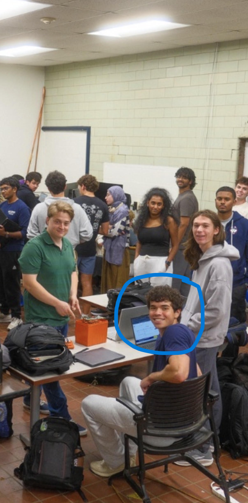

# UConn Formula SAE

An overview of my work in the EV section of UConn Formula SAE, a top-5 FSAE team.

## What I'm Working On

As a new member of the team, my project is to help design and build a custom low-voltage battery pack for our EV.

The pack will be around 24V and 10Ah and will power the lower-voltage electronics on the car, like the BMS, dashboard, sensors, and pumps.

I'm working with three others on the full design process, including figuring out how many battery cells we need, how they should be connected, what protection the pack needs, and how we're going to monitor the individual cells.

This project also includes designing a BMS PCB in Altium around the LTC6811. The BMS will keep track of the cells, balance their voltages, and help protect the battery pack.

I'll be updating this repo as the project progresses with my calculations, design decisions, schematics, PCB work, and eventually the finished pack.
