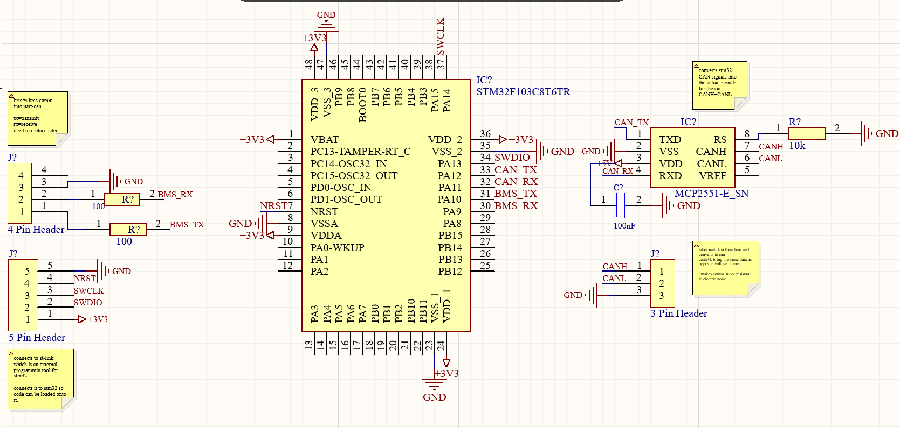

# Initial UART-to-CAN Converter Design

## Initial Design

As part of the initial LV battery system design, I developed a UART-to-CAN converter to allow the BMS to communicate with the vehicle's CAN bus.

The design uses an STM32F103 microcontroller to receive UART data from the BMS and interface with a CAN transceiver. The schematic also includes connections for CANH/CANL, power, decoupling, and an SWD header for programming and debugging the STM32.
